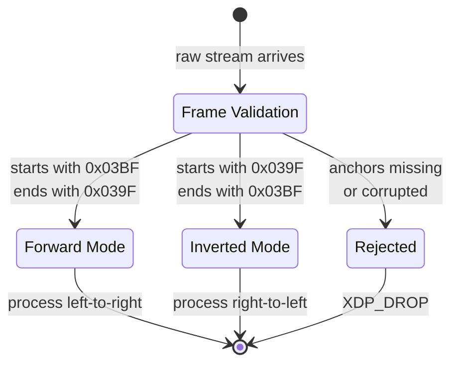

# The Omicron Anchors: 0x03BF and 0x039F

## Why Omicron?

The Greek letter omicron (ο, Ο) was chosen because its name literally contains its own mirror: omicron read backward is norcimo — but more importantly, the lowercase (omicron) and uppercase (OMICRON) bookend the Unicode Basic Multilingual Plane and the Supplementary Mathematical Plane.

- `U+03BF` (ο, Greek Small Letter Omicron) — the **low anchor**, 16-bit, fits in a single BMP code unit
- `U+039F` (Ο, Greek Capital Letter Omicron) — the **high anchor**, 16-bit, terminates the frame

Together they form a bidirectional validation gate: if a frame does not start with `0x03BF` and end with `0x039F` (or vice versa for inverted streams), it is rejected before any processing begins.

## Anchors as Escape Sequences

In binary protocol terms, the omicron anchors function as **escape sequences** — static byte patterns that a hardware scanner can detect without parsing the payload. An eBPF/XDP filter at the NIC level can scan the first and last 2 bytes of the IPv6 source address for these patterns and decide to drop or forward a packet before it reaches userspace.

## The Inversion Property

Because `omi---imo` is a palindrome, the anchors are invertible:

| Mode | Start | End | Meaning |
|------|-------|-----|---------|
| Forward | 0x03BF (omi) | 0x039F (imo) | Low→High, normal read |
| Inverted | 0x039F (imo) | 0x03BF (omi) | High→Low, reverse read |

Inversion flips the processing matrix: 4-character hex blocks are read right-to-left instead of left-to-right. This is essential for bi-directional data streams, RTL text handling, and circular buffer wraparound.

## The Constant C

The Delta Law's constant `C` (typically `0xACAB` or derived from `LL × 0x1337`) breaks the zero fixed point — without it, the transformation `rotl(x,1) XOR rotl(x,3) XOR rotr(x,2)` would map `0x0000` to `0x0000`, creating a sink state. The constant forces every orbit to move.

## The Omicron Constant

The Omicron Constant, `Omega_0`, is the minimum structural quantum of the OMI Object Model: one 4-character hex word, or one 16-bit register slice. It is the unit that every packet, pointer, and DOM projection scales from.

`Omega_0 = 16 bits = one 0xNNNN word`

The five tetrahedral packet frames sit inside this constant-sized word discipline:

| Frame | Packet | Role |
|-------|--------|------|
| `2^1` | facts | Binary assertions and chiral orientation flags |
| `2^2` | rules | Conditional constraints and tangential type routing |
| `2^3` | closures | Scoped environments and isolated bindings |
| `2^4` | combinators | The 16xy character/codepoint junction |
| `2^5` | cons | car/cdr continuation pointers |

Forward chirality starts with `0x03BF` and ends with `0x039F`, producing the positive `+16xy` cross-term. Inverted chirality starts with `0x039F` and ends with `0x03BF`, producing the negative `-16xy` recovery term.
