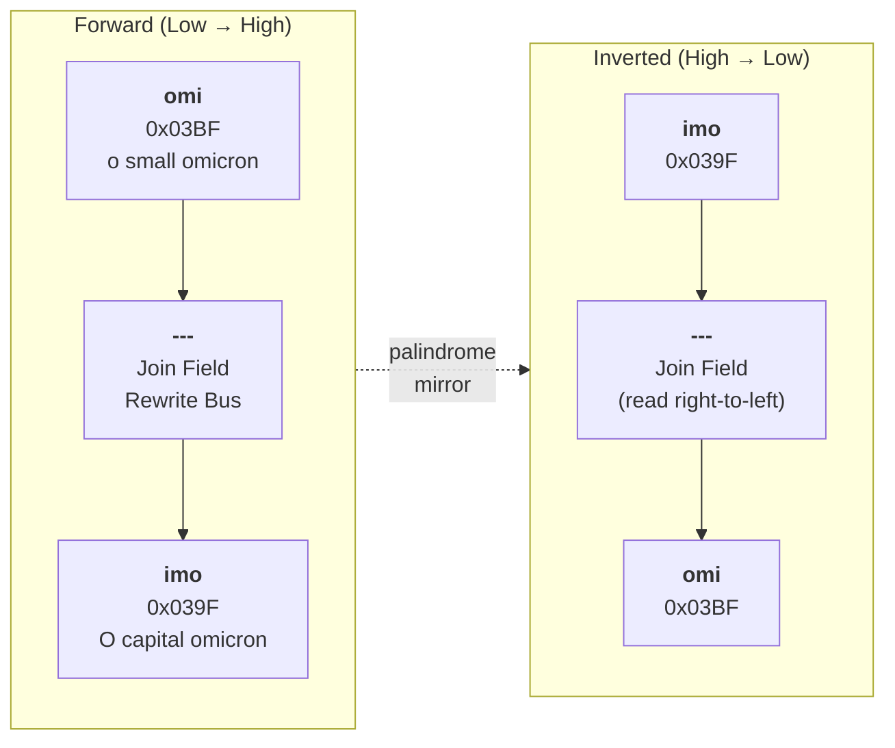

# The Palindrome: omi---imo

> This document is best read after [1.0 The Third Collapse](1.0_THE_THIRD_COLLAPSE.md) and [MANIFESTO.md](../MANIFESTO.md), which establish the philosophical lens of "notation as cipher" that this palindrome embodies.



## The Central Insight

The entire Omi Object Model turns on a single linguistic palindrome: `omi---imo`. Read it forward, it says "omi"; backward, it says "imo." The three hyphens between them are not decoration — they are the Join Field.

The hyphen is the operation. It carries the rewrite. It is the place where terms meet, twist, resolve, and become one bounded instruction. The same binary surface may be read forward as `omi` or backward as `imo`; the source remains unchanged, the interpretation rotates.

## What omi and imo Actually Are

- **omi** = Greek small letter omicron, `ο`, codepoint `U+03BF` (0x03BF). This is the Low Gate. The entry point. The question.
- **imo** = Greek capital letter omicron, `Ο`, codepoint `U+039F` (0x039F). This is the High Gate. The exit point. The answer.

The palindrome `omi---imo` is thus a complete transmission cycle: low-to-high, question-to-answer, input-to-output. The system inverts freely — `imo---omi` is equally valid and triggers the reverse processing matrix.

## The Hyphenated Encapsulation

The three hyphens encode a structural rule:

```
[omi] --- [payload] --- [imo]
0x03BF     -*-*-*-*-    0x039F
```

Everything between the omicron anchors is hyphen-delimited 4-character hexadecimal blocks (16 bits each). The hyphens act as the join field — they bind terms into one compound word while separating addressing domains. No bit can bleed across a hyphen, but the relation between the terms is carried by the hyphen itself.

The hyphen is simultaneously:

```text
a separator   — no bit bleeds across
a join field  — terms are bound into one word
a rewrite bus — the operation lives in the hyphen
a compiler lane — the hyphen declares how the frame compiles
```

This replaces the older "bus divider" view. The hyphen does not merely divide. It joins. It carries the rewrite. It is the operation.

## The 128-Character Frame

Every valid OMI transmission is exactly 128 characters long. This is not arbitrary — it is `2^7` characters, framing a `2^10` (1024-bit) instruction word. The omicron anchors consume 4 hex chars each (the prefix and suffix), leaving 120 characters of payload space:

```
┌──────┬──────┬──────┬──────┬──────┬──────┬──────┬──────┬──────┬──────┐
│ 03BF │ XXXX │ XXXX │ XXXX │ XXXX │ XXXX │ XXXX │ XXXX │ XXXX │ 039F │
│ omi  │  S₁  │  S₂  │  S₃  │  S₄  │  S₅  │  S₆  │  S₇  │  S₈  │ imo  │
└──────┴──────┴──────┴──────┴──────┴──────┴──────┴──────┴──────┴──────┘
  anchor    └──────────── 8 × 16-bit segments ────────────┘    anchor
  (4 hex)    └───── 4 hex chars each, hyphen-delimited ─────┘   (4 hex)
```

In the compressed 8-segment form (mapped to IPv6):

```
┌────────┬────────┬────────┬────────┬────────┬────────┬────────┬────────┐
│  S[0]  │  S[1]  │  S[2]  │  S[3]  │  S[4]  │  S[5]  │  S[6]  │  S[7]  │
│ XXXX   │ XXXX   │ XXXX   │ XXXX   │ XXXX   │ XXXX   │ XXXX   │ XXXX   │
├────────┼────────┼────────┼────────┼────────┼────────┼────────┼────────┤
│ origin │service │mirror  │ UPOS   │ stride │  slot  │ layer  │closure │
│ chiral │  bus   │ 5a3c   │  tag   │ 120/720│  0-54  │  0-7   │proven. │
└────────┴────────┴────────┴────────┴────────┴────────┴────────┴────────┘
```

## Universal Mnemonic Notation

`omi---imo` is not a font renderer or a DOM template. It is a **universal hyphenated palindromic mnemonic notation** — a bit-level addressing scheme where every 4-character hex chunk is a memory pointer, a register value, or an instruction opcode. The omicron anchors are escape sequences that frame the transmission.

## Omi-Ring

The palindrome is also the boundary of the Omi-Ring: the atomic waveform enclosure between `omi` and `imo`.

```text
omi  ->  Omi-Ring  ->  imo
low      declared      high
gate     activity      gate
```

The Ring captures intent as declared activity in space and time. Voice, image, gesture, light, sound, DOM, and canvas are carriers or projections; they are not authority by themselves. OMI does not force interpretation. OMI makes interpretation addressable.

See [1.3 The Omi-Ring](1.3_THE_OMI_RING.md).
