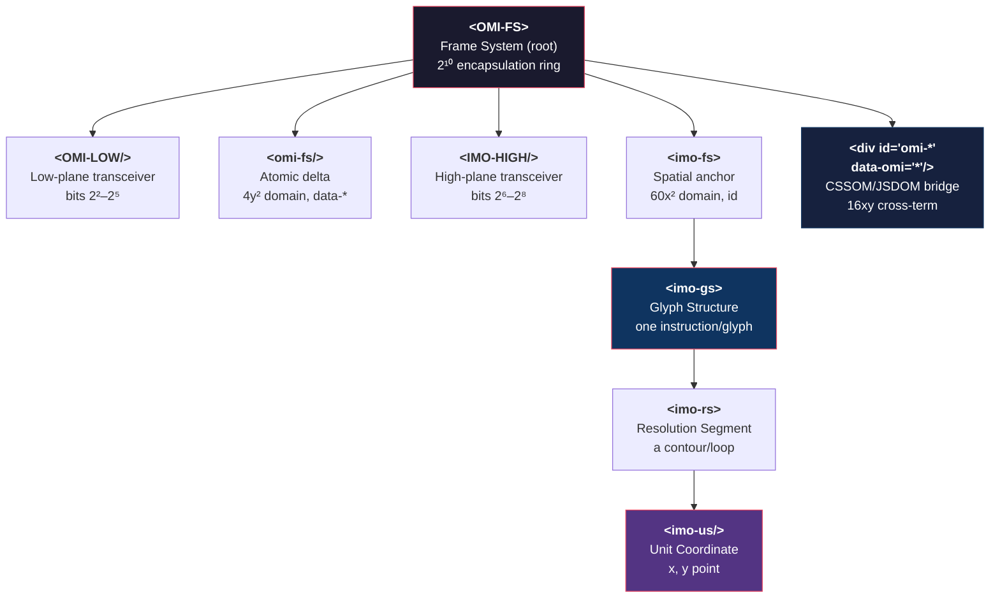

# The DOM Hierarchy: Elements as Register Gates

## The Element Tree

OMI defines a strict hierarchical DOM vocabulary. These are not HTML layout elements — they are **register gates** that encode bit-widths, memory offsets, and coordinate mappings.



## What Each Element Encodes

| Element | Bit Width | Domain | DOM Binding |
|---------|-----------|--------|-------------|
| `<omi />` | 16-bit | Low input (0x03BF) | `char` codepoint |
| `<imo />` | 16-bit | High output (0x039F) | `glyph-id` index |
| `<omi-fs>` | 2^2–2^5 | Atomic delta | `data-*` attributes |
| `<imo-fs>` | 2^6–2^8 | Spatial anchor | `id` attribute |
| `<imo-gs>` | Variable | Glyph structure | Container for contours |
| `<imo-rs>` | 16-bit array | Resolution segments | Contour end-point indices |
| `<imo-us>` | 8/16-bit | Unit coordinates | `x`, `y` points |
| `<div id="omi-*" data-omi="*">` | 16xy | CSSOM/JSDOM bridge | The execution interface |

## The Floating Nodes

Floating `<OMI-* />` and `<IMO-* />` elements are **wormhole portals** — they bypass the standard tree hierarchy entirely. They use:
- **ShadowDOM** — full encapsulation capsules
- **SVG `<use>`** — glyph geometry teleportation
- **innerHTML** — iframe-like state isolation
- **`contenteditable`** — live state modification

Floating nodes pair `id` (x, high-plane) with `data-omi` (y, low-plane) to create the `16xy` cross-term junction. A CSS selector `[data-omi^="low-plane-val-"]` can target any floating node instantly.

## The Cosmic Bit Width Registry

Element word lengths map to specific bit tiers:

| Tier | Width | Element |
|------|-------|---------|
| Low | 22–25 bits | `<omi-fs>`, `<OMI-LOW>` |
| High | 26–28 bits | `<imo-fs>`, `<IMO-HIGH>` |
| Pointer | 29 bits | The cross-term junction `<div id= data-omi=>` |
| Encapsulation | 2^10 (1024-bit) | The full `<OMI-FS>` ring |

## Four Object-Model Projection Layers

The `2^12` master configuration projects into the `2^10` omicron enclosure through a `2^2` interpretation matrix:

| Layer | Browser model | OMI term |
|-------|---------------|----------|
| 1 | JSDOM | `60x^2`, high identity, `id="omi-*"` |
| 2 | CSSOM | `4y^2`, low state, `data-omi="*"` |
| 3 | DOM | `16xy`, live element junction |
| 4 | SpectrumDOM / PixelDOM | `G(AA) = (V:RR, E:GG, I:BB, A:AA)` |

`unicode-bidi` is an upper reader lens for projection chirality. Forward nodes use `id^="omi-"` with `direction: ltr`; inverted nodes use `id^="imo-"` with `direction: rtl`. The same accepted frame can therefore be read in high-definition forward state or low-definition inverse recovery state, but lower validity still belongs to Omicron anchors, `Q_frame(S)`, Delta/Fano resolution, and receipts.

Any atomic symbol can appear after the prefix as long as it remains a canonical token:

```html
<div id="omi-CANONICAL_MAPPING_OF_0x1100_TO_0xAA55" data-omi="combinator-byte-65"></div>
<div id="imo-ANY_SYMBOL_OR_EMOJI" data-omi="inverse-state"></div>
```

## Nibble and Control-Code Interpolation

The `2^8` combinator byte splits into two nibbles:

| Mask | Nibble | Routes |
|------|--------|--------|
| `0xF0` | high nibble | FS/GS macro structure |
| `0x0F` | low nibble | RS/US local unit offsets |

## Control Codes as Rewrite Operators

The full ASCII control range `0x00..0x1F` is not merely non-printing characters. These codes were historically protocol operations: they start, stop, shift, acknowledge, separate, return, and advance. OMI restores their original force as rewrite operators.

The four canonical OMI separators are a subset of this rewrite space:

| Code | Name | Axis | OMI Role |
|------|------|------|----------|
| `0x1C` | FS | top | Frame System root delimiter |
| `0x1D` | GS | right | Glyph Structure delimiter |
| `0x1E` | RS | bottom | Resolution Segment delimiter |
| `0x1F` | US | left | Unit Coordinate delimiter |

These control characters drive JSON Canvas projections, SpectrumDOM color fields, and raw binary packet interpolation without changing the underlying OMI frame.

For the full treatment of the ASCII rewrite surface -- including the projective boundary between control codes (`0x00..0x1F`) and printable projections (`0x20..0x7F`) -- see [3.4 Control Codes and Printable Projections](3.4_CONTROL_CODES_AND_PRINTABLE_PROJECTIONS.md).
