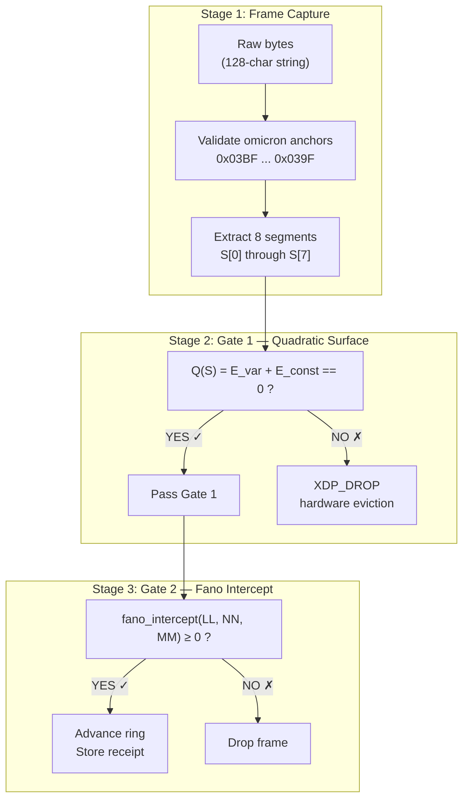

# The Meta-Circular Chronograph Compiler

> This document is best read alongside [1.5 The Slash Path](../1_FOUNDATIONS/1.5_THE_SLASH_PATH.md) and [1.0 The Third Collapse](../1_FOUNDATIONS/1.0_THE_THIRD_COLLAPSE.md), which establish the hyphen-as-rewrite-field and notation-as-cipher principles that this compiler instantiates.

## Self-Hosting at the Core

A meta-circular compiler is one written in its own language. OMI's chronograph compiler is meta-circular because:

1. The **instruction format** (8 × 16-bit hex segments bounded by omicrons) is both the code and the data
2. The **quadratic law** (`60x² + 16xy + 4y²`) evaluates frame validity using the same arithmetic that the frame encodes
3. The **Delta Law** (`rotl ⊕ rotl ⊕ rotr ⊕ C`) period-8 orbit is the same transformation applied at every level — from gate validation to memory ring advancement

## The Hyphen as Rewrite Field

In OMI, the hyphen is the operation. The compiler reads the hyphen-delimited segments as a single 1024-bit instruction word, but the hyphens are not passive separators. Each hyphen is a rewrite field: it declares how the adjacent terms are joined.

The canonical instruction-word grammar is:

```text
<omi-word> ::= omi "-" <local-address> "-" <rewrite-operator> "-" <expanded-address> "-" imo
```

The rewrite-operator field carries the computation. The hyphens bracket the operator, declaring that the terms on either side are not merely sequential data but relationally bound by the operation between them.

This is the slash path's mechanical form. The slash path names the roles:

```text
omi-<frame>/<control>/<scale>/<relation>/<unit>-imo
```

The hyphens bind. The slashes name the binding's role. See [1.5 The Slash Path](../1_FOUNDATIONS/1.5_THE_SLASH_PATH.md).

## The Single 1024-Bit Instruction Word

Every OMI transmission is a single 128-byte (1024-bit) word:

```
    2 bytes      2 bytes       4 bytes          2 bytes
┌───────────┬───────────┬──────────────────┬──────────────┐
│  0x03BF   │  NN (16)  │  MMMM (32)       │   0x039F     │
│  (omi)    │  payload  │  payload          │   (imo)      │
└───────────┴───────────┴──────────────────┴──────────────┘
  anchor       car ptr       cdr ptr          anchor
```

In the 8-segment IPv6 form:

```
S[0]  S[1]  S[2]  S[3]  S[4]  S[5]  S[6]  S[7]
XXXX-XXXX-XXXX-XXXX-XXXX-XXXX-XXXX-XXXX
```

## The Three-Stage Pipeline



## The Chronograph

## The Chronograph

The chronograph is the timekeeping layer. The `W = 36` stride (sum of the orbit weight block `[0,1,3,6,9,8,6,3]`) determines the cadence:

```mermaid
flowchart LR
    subgraph Ticks["Chronograph Ticks"]
        P0["frame 0"] --> P1["frame 1"] --> P2["..."] --> P35["frame 35"] --> P36["frame 36<br/>(wraps)"]
    end

    subgraph Division["divmod(position, 36)"]
        MACRO["macro-cycle quotient<br/>which 36-block"]
        LOCAL["local offset 0..35<br/>which step in block"]
    end

    P0 --> LOCAL
    P36 --> MACRO
``````

This is not a clock — it is a **geometric time**. The chronograph ticks forward based on orbital distance traveled through Delta Law state space, not wall-clock seconds.

## Why Meta-Circular Matters

Because the compiler is meta-circular, any OMI frame can be:
- A **valid instruction** (processed through Gate 1 and Gate 2)
- A **compiler directive** (modifying how subsequent frames are processed)
- A **memory receipt** (stored in the ring indexer and queried by provenance)

There is no distinction between code, data, and metadata. Everything is an OMI frame.

## Static Assembly Runtime

The browser runtime does not require WebRTC for local consensus. It can compile static assembly declarations into the shared OMI bus:

```text
FACT: NOUN | OPEN | INFLECTION
SYNSET: 0x00A1B2
COMBINATOR: 0x41
```

The assembler maps:

| Field | Range | OMI term |
|-------|-------|----------|
| Universal PoS/features | `0x0000..0xFFFF` | `4y^2` |
| ASCII/Unicode combinator | `0x00..0x7F` primary row | `16xy` |
| WordNet synset pointer | `0x000000..0xFFFFFF` | `60x^2` |

The canonical element selector is hyphenated, not dotted:

```text
omi-CANONICAL_MAPPING_OF_0x0000_TO_0xAA55
```

## Transaction Primitives

DevTools and Wasm expose four transaction functions so cons pointers can round-trip:

| Function | Purpose |
|----------|---------|
| `join(slotA, slotB, targetSlot)` | Combine car features from A with cdr pointer from B |
| `compose(slotStart, text, featureFlags, synset)` | Compile a string into sequential instruction slots |
| `parse(canonicalSelector)` | Reconstruct a 128-byte frame from a live DOM element |
| `replay(history, targetSlot)` | Stream stored frames back into the shared bus |

This is the self-hosting loop: assembly compiles to binary, binary projects to DOM/SpectrumDOM, DOM parses back to binary, and replay rehydrates the frame history.

The meta-circular nature is the operational expression of notation as cipher: the same surface is both code (instruction) and data (frame), distinguished only by the active reading. The rewrite is the computation. See [MANIFESTO.md](../MANIFESTO.md).
