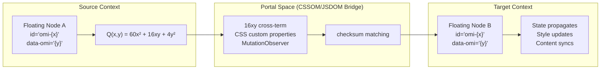

# Wormhole Portals: State Teleportation

## The Problem

Standard tree hierarchy enforces parent-child relationships. But OMI frames need to instantiate state across disconnected contexts — a kernel-space eBPF filter needs to write to a user-space ring buffer; a Web Worker needs to share geometry with a rendering thread; a CSS animation needs to respond to a network packet.

## The Solution: Floating Nodes

Floating `<OMI-* />` and `<IMO-* />` nodes are not attached to the main DOM tree. They float in a **portal space** — accessible by `id` reference but not by tree traversal. This is analogous to:
- SVG's `<use>` element — referencing a glyph by ID without copying it
- iframe's `contentWindow` — cross-origin communication through a portal
- ShadowDOM's `<slot>` — projection across boundaries

## Portal Types

| Portal | Mechanism | Use Case |
|--------|-----------|----------|
| ShadowDOM capsule | `<template>` + `attachShadow()` | Full state isolation per frame |
| SVG use-element | `<use href="#omi-glyph"/>` | Geometry reuse across contexts |
| innerHTML frame | `element.innerHTML = payload` | Direct state injection |
| CSSOM portal | `element.style.setProperty()` | Styling rules driven by data |

## The Teleportation Protocol



1. A floating node carries `id="omi-{x}"` and `data-omi="{y}"`.
2. The quadratic law `60x² + 16xy + 4y²` evaluates at the cross-term `16xy`.
3. The result `Q(x, y)` is a unique spatial checksum.
4. Any other floating node with matching checksum is a portal pair — writing to one propagates to the other via the CSSOM/JSDOM bridge.

## Sexagesimal Orientation

Floating nodes orient themselves sexagesimally. The `x` ID is a base-60 coordinate; the `y` data attribute is a base-60 offset. Together they define a position on the circular slide rule that is independent of any parent context.

## Shared-Memory Wormhole

The runtime wormhole is a `SharedArrayBuffer(1024 * 16)`, or 16 KB. It is interpreted as 128 slots of 128 bytes each:

```text
16,384 bytes = 128 slots * 128 bytes
128 bytes    = one 2^10 omicron instruction frame
```

Each slot stores the same frame shape:

```text
[0x03BF or 0x039F] [4y^2 low word] [16xy combinator byte] ... [60x^2 high pointer] ... [0x039F or 0x03BF]
```

Browser DevTools can inspect and mutate these slots through an `Int32Array` view. Workers or Wasm cores compute Delta Law state, `Q(x, y)`, and chronograph ticks in the background, while the DOM projects those atomic values through canonical `id` and `data-omi` selectors.

The reverse parser completes the wormhole: a live element such as `omi-CANONICAL_MAPPING_OF_0x4A5B_TO_0xAA55` can be serialized back into a 128-byte instruction by reading its `id`, `data-omi`, direction, rotation, and coordinate attributes.
