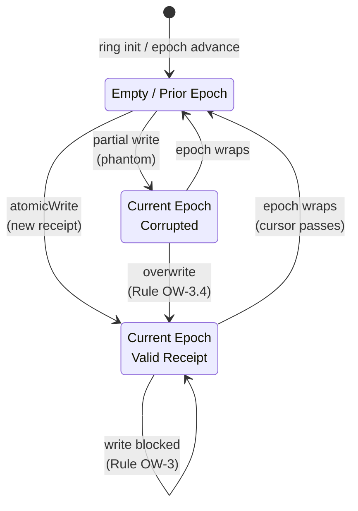

# Ring Overwrite Policy v0

## The Problem

The 5040-slot ring is a fixed buffer. When the cursor wraps (approximately every `5040/avg_steps` receipts), it begins overwriting slots that may still contain live receipts from the current epoch.

## Slot States



| State | Condition | Action |
|-------|-----------|--------|
| Cold | `existing_epoch < current_epoch` | Overwrite permitted (safe) |
| Warm | `existing_epoch == current_epoch`, Q(S)=0 | Drop new frame (slot occupied) |
| Corrupt | `existing_epoch == current_epoch`, Q(S)≠0 | Overwrite permitted (phantom slot) |

## Rule OW-1: Epoch Tag Matching

Before any `atomicWrite`, the writer MUST read the existing slot value and compare its provenance epoch:

```
existing_epoch = (slot >> 48n) & 0xFF00n >> 8
current_epoch = ring.epoch
```

## Rule OW-2: Cold Overwrite

If `existing_epoch < current_epoch`, the slot belongs to a prior epoch. Overwrite is permitted without re-verification.

## Rule OW-3: Warm Overwrite

If `existing_epoch == current_epoch`, the slot is warm. The writer:

1. Unpacks the existing slot via `unpackSlot()`
2. Runs `isOrbitLexerValid()` on the existing frame
3. If `Q(S) == 0` and valid → drop the new frame (slot is live)
4. If `Q(S) != 0` → overwrite permitted (slot is corrupted)

## Rule OW-4: Phantom Write Protection

A phantom write occurs when a non-atomic reader sees a partially-updated slot. The provenance field is written first (upper 16 bits), so the atomic read always sees a consistent epoch tag even if the lower 48 bits are still being written.

## Epoch Wraparound Stress

The epoch counter is 8 bits (0–255). Under maximum sustained load (avg 1 step per receipt), the ring wraps every 5040 writes. The epoch wraps every 5040 × 256 ≈ 1.29M receipts. Stress tests verify:
- No slot corruption at wraparound
- No lost receipts within epoch boundaries
- Correct behavior under concurrent CAS contention
