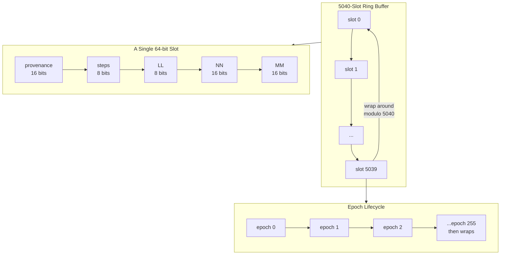
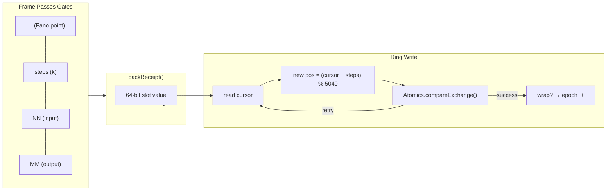

# The Ring Indexer: 5040-Slot Circular Buffer

## The 7! Replay Ring

OMI's memory is a fixed circular buffer of 5040 slots — exactly `7!` (7 factorial). Each slot is a 64-bit BigInt storing a single receipt:



```
Bit layout: | provenance:16 | steps:8 | LL:8 | NN:16 | MM:16 |
MSB                                                                LSB
┌──────────────┬─────────┬────────┬────────────┬──────────────┐
│  0x0100      │  0x01   │  0x01  │  0x7C00    │  0x1434      │
│  provenance  │  steps  │  LL    │  NN        │  MM          │
│  epoch=1     │  1 step │  Fano  │  boot addr │  resolved to │
│  sub=0       │         │  pt 1  │            │              │
└──────────────┴─────────┴────────┴────────────┴──────────────┘
```

| Field | Width | Range | Meaning |
|-------|-------|-------|---------|
| provenance | 16 bits | 0–65535 | Epoch + sub-epoch identifier |
| steps | 8 bits | 0–15 | Steps taken in Fano resolution |
| LL | 8 bits | 1–7 | Fano plane point identifier |
| NN | 16 bits | 0–65535 | Free variable (input column) |
| MM | 16 bits | 0–65535 | Free variable (output column) |

## The Winding Ledger

Memory advancement is a function of orbital distance. When a frame passes both gates:



1. The Delta Law resolver produces `(LL, steps, NN, MM)`.
2. `packReceipt()` encodes these into a 64-bit slot.
3. `advance()` writes the slot at the current cursor position.
4. The cursor moves forward by `steps` positions.
5. If the cursor exceeds 5039, it wraps modulo 5040 — the epoch increments.

## Atomic Cursor

The cursor is a 64-bit atomic counter managed via `Atomics.compareExchange`:

```
read current cursor
compute new position = (cursor + steps) % 5040
Atomics.compareExchange(cursor, current, new)
```

If the CAS fails (contention), the writer retries. No locks, no mutexes, no contention beyond the CAS loop.

## The Boot Genesis

Slot 1504 is the canonical boot slot. The genesis frame writes:

```
Provenance: 0x0100
Steps: 1
LL: 0x01
NN: 0x7C00
MM: 0x1434
```

This is the "Big Bang" of the ring — the first receipt from which all subsequent receipts derive their epoch context.

## The 5040 Slot Decomposition

The ring has 5040 slots because `7! = 5040`. But the internal structure decomposes through the 240-state bridge:

```text
5040 = 7 × 3 × 240
```

Each slot position can be expressed as:

```text
slot5040 = fano7 × 720 + role3 × 240 + local240
```

Where:

```text
fano7    ∈ 0..6   (Fano plane selector)
role3    ∈ 0..2   (S-P-O semantic role)
local240 ∈ 0..239 (oriented packet / active byte surface)
```

The `local240` component may be derived from either the five-fold packet root or the four-fold selector surface:

```text
five-fold:  2 × 5! = 240
four-fold:  15 × 16 = 240
```

This means every receipt slot simultaneously encodes:
- Which Fano point resolved the transition (7 choices)
- Which semantic role the receipt occupies (3 choices: subject/predicate/object)
- Which oriented packet state or active byte surface was recorded (240 states)

The 5040 ring is therefore not an arbitrary buffer size. It is the exact number of distinct `(Fano, role, state)` triples in a complete replay cycle.

See also: [2.8 Five-Fold, Four-Fold, and the 240-State Bridge](../2_MATH/2.8_FIVE_FOLD_FOUR_FOLD_AND_THE_240_BRIDGE.md)
