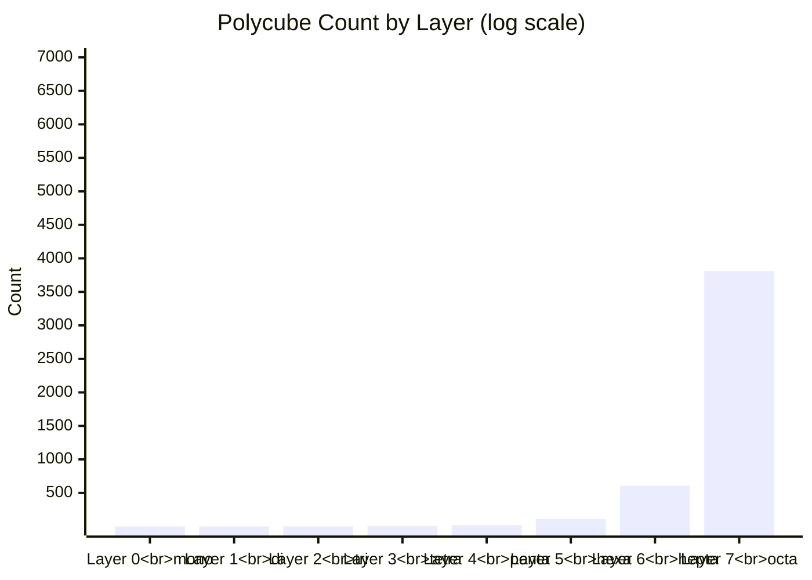
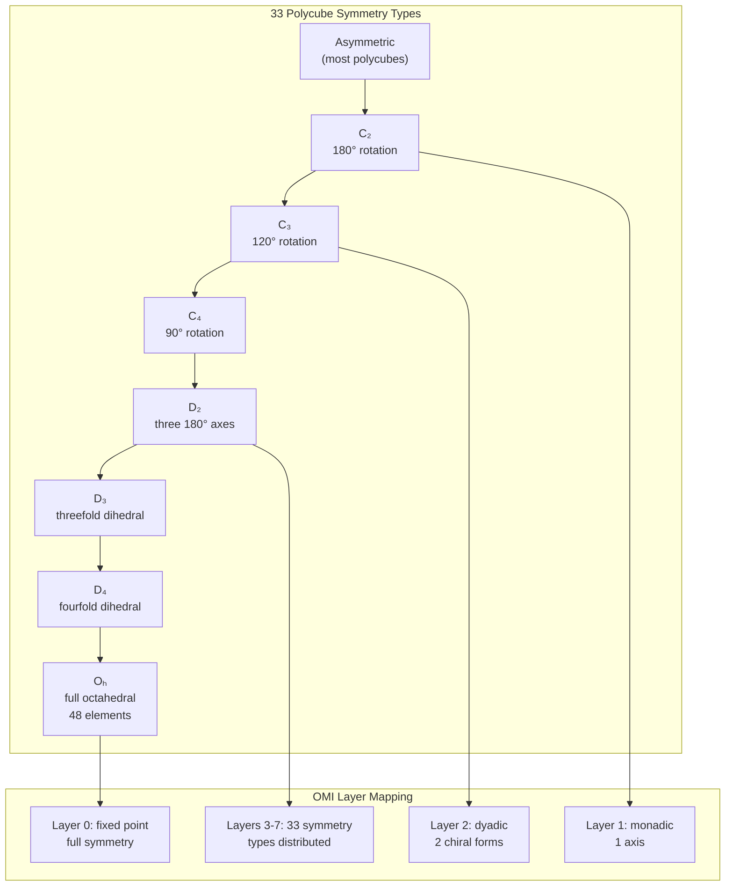

# Polycubes and Symmetry Groups

## Combinatorial Geometry

OMI's factorial layers (segment[6]) map to specific polychoron counts, mirroring the enumeration of polycubes in 3D space:



| Layer | Name | Free Polycubes | One-Sided | Geometric Meaning |
|-------|------|----------------|-----------|-------------------|
| 0 | Fixed Point | 1 | 1 | The origin (monocube) |
| 1 | Monadic | 1 | 1 | A single connection (dicube) |
| 2 | Dyadic | 2 | 2 | Two chiral forms (tricubes) |
| 3 | Octahedral | 7 | 8 | Free polycubes (tetracubes) |
| 4 | 24-cell | 23 | 29 | Pentacube chiral pairs |
| 5 | 120-cell | 112 | 166 | Hexacube symmetry groups |
| 6 | 720-sweep | 607 | 1023 | Heptacube enumeration |
| 7 | Replay Ring | 3811 | 6922 | Octacube full census |

## Chiral Pair Distinction

Unlike polyominoes (2D), polycubes in 3D distinguish mirror reflections because you cannot flip a polycube over to reflect it. OMI encodes both one-sided (reflections distinct) and free (reflections counted together) counts in its addressing scheme.

## Symmetry Types



Polycubes exhibit 33 distinct symmetry types (conjugacy classes of subgroups of the achiral octahedral group). OMI's 8-layer factorial system maps these onto the segment[6] address space, with the Fano plane LL identifier `{0x01..0x07}` selecting the projective symmetry subgroup.

## Factorial Layer Bridge

The polycube layer counts are not arbitrary — they correspond to the factorial tower that structures OMI address space. The critical hinge is between layers 4 and 5, where the four-fold selector surface meets the five-fold packet root:

| Layer | Polycube | Free Count | Factorial | OMI Role |
|---|---|---|---|---|
| 3 | tetracubes | 7 | 4! = 24 | four-fold selector surface |
| 4 | pentacubes | 23 | 5! = 120 | five-fold packet root |
| 5 | hexacubes | 112 | 6! = 720 | semantic sweep |
| 6 | heptacubes | 607 | 7! = 5040 | Fano replay ring |

The four-fold layer (`4! = 24`) produces 24 permutations of four channel positions (FS/GS/RS/US). This is where a rooted packet becomes selectable and projectable.

The five-fold layer (`5! = 120`) is the packet root — the smallest complete semantic universe before orientation, sweep, or replay. It maps to the 5-cell simplex in 4D geometry.

The two layers meet at the 240-state bridge:

```text
five-fold side:  2 × 5! = 240
four-fold side:  15 × 16 = 240
```

The free polycube count of 23 (pentacubes) is one less than 24 because one configuration is the fully symmetric 24-cell root. The 112 (hexacubes) approaches 120 — missing 8 configurations absorbed by the 24-cell projection surface. These gaps reflect the geometric constraint that the polycube enumeration samples the factorial space rather than filling it completely.

From 240, the factorial tower climbs into the replay ring:

```text
3 × 240 = 720  (6! semantic sweep)
7 × 720 = 5040 (7! Fano replay ring)
```

Thus the polycube census is a visible projection of the OMI factorial address geometry.

See also: [2.8 Five-Fold, Four-Fold, and the 240-State Bridge](2.8_FIVE_FOLD_FOUR_FOLD_AND_THE_240_BRIDGE.md)
