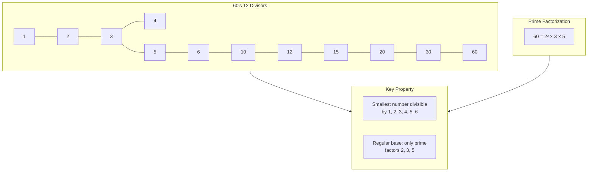
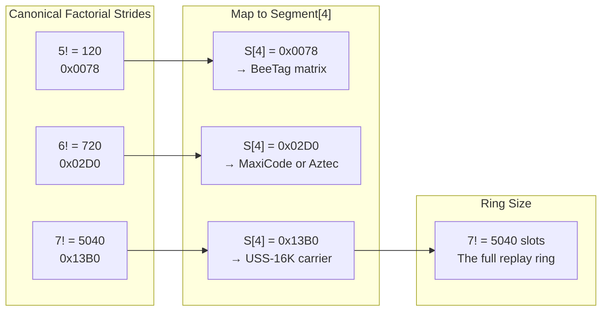

# The Sexagesimal System: Base-60

## Why 60

60 is the smallest number divisible by every integer from 1 to 6. It has 12 divisors: 1, 2, 3, 4, 5, 6, 10, 12, 15, 20, 30, 60. This makes it a **superior highly composite number** — the ideal base for fractional arithmetic without rounding error.

This divisibility means every fraction `a/n` where `n` has only factors 2, 3, 5 resolves **exactly** in base-60 — no repeating decimals, no truncation error.

## Fractional Exactness

In base-60, any fraction whose denominator has only prime factors 2, 3, and 5 (the regular numbers) resolves exactly:

| Fraction | Sexagesimal |
|----------|-------------|
| 1/2 | 0;30 |
| 1/3 | 0;20 |
| 1/4 | 0;15 |
| 1/5 | 0;12 |
| 1/6 | 0;10 |

This property is critical for OMI's spatial geometry. When the quadratic law `60x² + 16xy + 4y²` divides coordinate space, the sexagesimal base guarantees that subdividing a unit into 2, 3, 4, 5, or 6 equal parts never produces a repeating fraction.

## The Hellenistic Slot

Segment[5] of every OMI frame is bounded to `0x0000–0x0036` (0–54 in decimal). This is the sexagesimal slot — the 55 valid positions (0–54) on a circular slide rule. The 55th position (54) acts as the terminal fence.

## Factorial Strides

The canonical OMI strides are themselves sexagesimal numbers:

| Stride | Hex | Decimal | Property |
|--------|-----|---------|----------|
| 120 | 0x0078 | 5! | Smallest factorial beyond 4! |
| 720 | 0x02D0 | 6! | Sexagesimal 0;12 (720/60) |
| 5040 | 0x13B0 | 7! | The full replay ring size |

These map directly to segment[4] of the OMI frame, identifying the stride context for the transmission.
