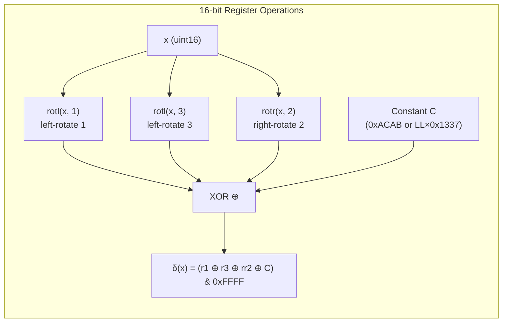
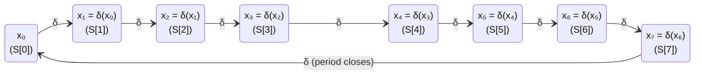
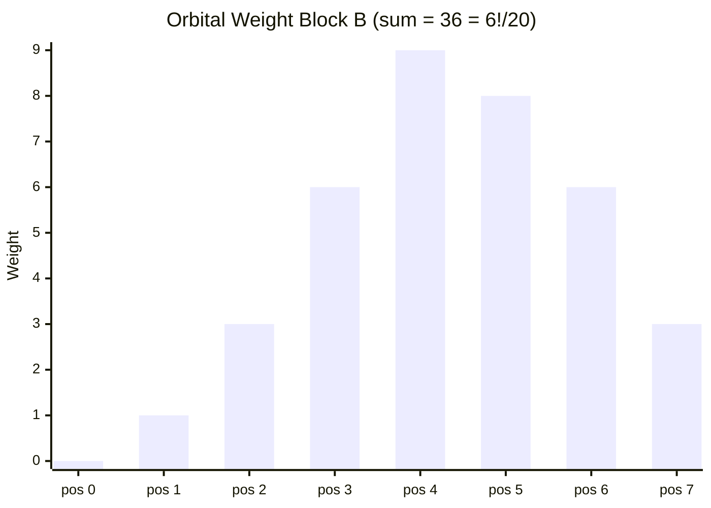
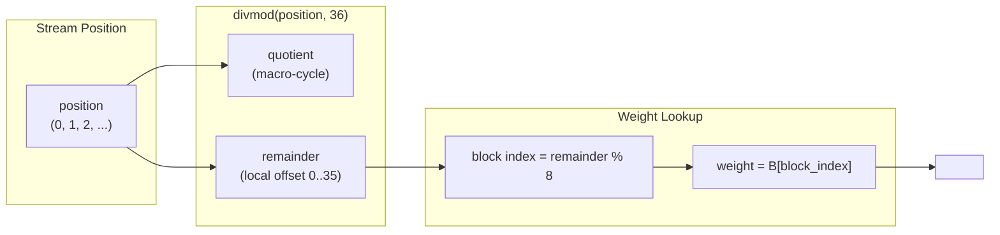

# The Delta Law: The Period-8 Engine

## The Atomic Design Decision

The Delta Law is the minimal reversible transformation at the heart of OMI. It is not an arbitrary hash — it was the product of a single design constraint:

```
rotl(x, 1) XOR rotl(x, 3) XOR rotr(x, 2) XOR C
```



Four deliberate choices:
1. **Rotations, not shifts** — no bits are ever lost
2. **XOR** — fully reversible (XOR is its own inverse)
3. **Constant C** — breaks the zero fixed point (without C, 0 maps to 0)
4. **Mask to 16-bit width** — keeps state bounded to uint16

## Properties That Emerged

From this single law, everything else was computed by the math:

- **Period = 8** — a property of the specific rotation constants (1, 3, 2) on 16-bit space. Every state returns to itself after exactly 8 applications.
- **Prime 73** — the reciprocal decimal expansion `0.01369863...` gives the orbital weight sequence `[0, 1, 3, 6, 9, 8, 6, 3]` which sums to 36 = `6! / 20`.
- **Fano plane resolution** — any trajectory through the Delta Law converges within at most 15 steps, bounded by the Fano plane's projective geometry.

## The Orbit

Given an initial state `x₀`, the Delta Law generates a closed orbit of length 8. Every state returns to itself after exactly 8 applications:



This period-8 property maps directly to the 8 segments of an OMI frame. Each segment `S[0]` through `S[7]` can be thought of as a point on a Delta Law orbit.

## Weight Block: Orbital Mass

The reciprocal of prime 73 gives the decimal expansion `0.01369863...` which defines the orbital weight sequence:

```
Position:   0   1   2   3   4   5   6   7
Weight:    [0,  1,  3,  6,  9,  8,  6,  3]
            ↓   ↓   ↓   ↓   ↓   ↓   ↓   ↓
Sum = 36  ───────────────────────────────
```

This weight block modulates how much "mass" each orbital position carries:



## Gate 2: Fano Intercept

The second validation gate combines the Delta Law with the Fano plane:

```
Q(N, M) = 0  ∧  fano_intercept(a, b, c) ≥ 0
```

Where the Fano point `LL ∈ {0x01..0x07}` identifies one of 7 projective points. The lexer verifies that two rays with distinct `LL₁ ≠ LL₂` resolve their intersection within the bound of ≤ 15 Delta Law steps. This is the "Transylvania Lottery" resolver.

## W = 36

The weight sum `W = 36` (from the digit block `[0,1,3,6,9,8,6,3]`) is the master frame stride:

```
position ÷ 36 = macro-cycle quotient ──→ which 36-frame block
position % 36 = local offset        ──→ which weight applies
```


