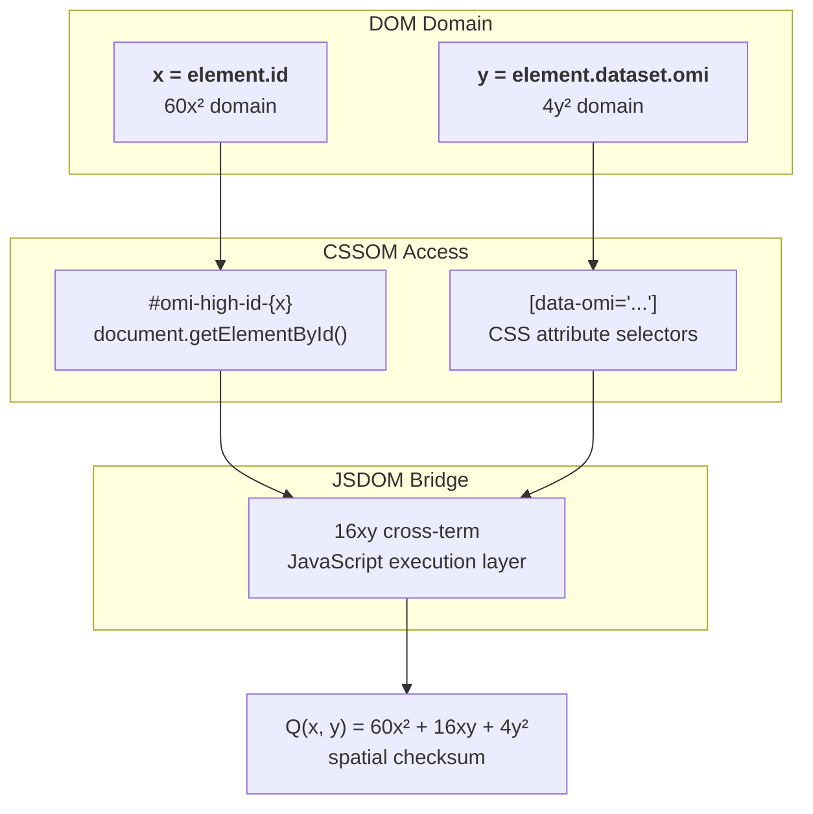

# The Quadratic Law: 60x² + 16xy + 4y²

## The Structural Equation

The entire OMI spatial geometry is governed by one binary quadratic form:

```
Q(x, y) = 60x² + 16xy + 4y²
```



This is not arbitrary. Each coefficient encodes a physical domain boundary:

| Term | Gate | Binding | Meaning |
|------|------|---------|---------|
| `60x²` | High (IMO) | `id` attribute | Sexagesimal spatial orientation, CSSOM access |
| `16xy` | Cross | CSSOM/JSDOM bridge | The active execution matrix where code meets DOM |
| `4y²` | Low (OMI) | `data-*` attribute | Localized atomic data, CSS attribute selectors |

## Matrix Form

```
Q(x,y) = [x y] [60  8] [x]
               [ 8  4] [y]

det(A) = (60)(4) - (8)² = 240 - 64 = 176
```

The positive-definite nature (`det > 0`, leading principal minors > 0) guarantees the surface is an elliptic paraboloid — meaning valid pointer pairs `(x, y)` form a convex, bounded space with no saddle points.

## What x and y Actually Are

In the OMI DOM hierarchy:

- **`x`** is the `id` property — the high-plane structural asset. Accessed via `document.getElementById()`. It lives in the `60x²` domain.
- **`y`** is the `data-*` property — the low-plane atomic data. Accessed via `[data-omi]` CSS selectors. It lives in the `4y²` domain.
- **`16xy`** is the JavaScript execution layer where `x` and `y` resolve into valid layout coordinates.

## Surface Visualization

```
Q(x,y) = 60x² + 16xy + 4y²  for x,y ∈ [0, 15]

 y→
   ┌───┬───┬───┬───┬───┬───┬───┬───┬───┬───┬───┬───┬───┬───┬───┬───┐
   │   │   │   │   │   │   │   │   │   │   │   │   │   │   │   │   │
15 │   │   │   │   │   │   │   │   │   │   │   │   │   │   │   │   │
   │   │   │   │   │   │   │   │   │   │   │   │   │   │   │   │   │
14 │   │   │   │   │   │   │   │   │   │   │   │   │   │   │   │   │
   │   │   │   │   │   │   │   │   │   │   │   │   │   │   │   │   │
13 │   │   │   │   │   │   │   │   │   │   │   │   │   │   │   │   │
   │   │   │   │   │   │   │   │   │   │   │   │   │   │   │   │   │
12 │   │   │   │   │   │   │   │   │   │   │   │   │   │   │   │   │
   │   │   │   │   │   │   │   │   │   │   │   │   │   │   │   │   │
11 │   │   │   │   │   │   │   │   │   │   │   │   │   │   │   │   │
   │   │   │   │   │   │   │   │   │   │   │   │   │   │   │   │   │
10 │   │   │   │   │   │   │   │   │   │   │   │   │   │   │   │   │
   │   │   │   │   │   │   │   │   │   │   │   │   │   │   │   │   │
 9 │   │   │   │   │   │   │   │   │   │   │   │   │   │   │   │   │
   │   │   │   │   │   │   │   │   │   │   │   │   │   │   │   │   │
 8 │   │   │   │   │   │   │   │   │   │   │   │   │   │   │   │   │
   │   │   │   │   │   │   │   │   │   │   │   │   │   │   │   │   │
 7 │   │   │   │   │   │   │   │   │   │   │   │   │   │   │   │   │
   │   │   │   │   │   │   │   │   │   │   │   │   │   │   │   │   │
 6 │ █ │ █ │ █ │ █ │ █ │ █ │ █ │   │   │   │   │   │   │   │   │   │
   │ █ │ █ │ █ │ █ │ █ │ █ │ █ │   │   │   │   │   │   │   │   │   │
 5 │ █ │ █ │ █ │ █ │ █ │ █ │ █ │ █ │   │   │   │   │   │   │   │   │
   │ █ │ █ │ █ │ █ │ █ │ █ │ █ │ █ │   │   │   │   │   │   │   │   │
 4 │ █ │ █ │ █ │ █ │ █ │ █ │ █ │ █ │ █ │   │   │   │   │   │   │   │
   │ █ │ █ │ █ │ █ │ █ │ █ │ █ │ █ │ █ │   │   │   │   │   │   │   │
 3 │ █ │ █ │ █ │ █ │ █ │ █ │ █ │ █ │ █ │ █ │   │   │   │   │   │   │
   │ █ │ █ │ █ │ █ │ █ │ █ │ █ │ █ │ █ │ █ │   │   │   │   │   │   │
 2 │ █ │ █ │ █ │ █ │ █ │ █ │ █ │ █ │ █ │ █ │ █ │   │   │   │   │   │
   │ █ │ █ │ █ │ █ │ █ │ █ │ █ │ █ │ █ │ █ │ █ │   │   │   │   │   │
 1 │ █ │ █ │ █ │ █ │ █ │ █ │ █ │ █ │ █ │ █ │ █ │ █ │   │   │   │   │
   │ █ │ █ │ █ │ █ │ █ │ █ │ █ │ █ │ █ │ █ │ █ │ █ │   │   │   │   │
 0 │ █ │ █ │ █ │ █ │ █ │ █ │ █ │ █ │ █ │ █ │ █ │ █ │ █ │ █ │ █ │ █ │
   └───┴───┴───┴───┴───┴───┴───┴───┴───┴───┴───┴───┴───┴───┴───┴───┘
   0   1   2   3   4   5   6   7   8   9  10  11  12  13  14  15   x→

  █ = Q(x,y) < 1000 (valid pair zone, elliptic paraboloid contour)
```

## Sexagesimal Rationale

The coefficient 60 is a superior highly composite number — divisible by 1, 2, 3, 4, 5, 6, 10, 12, 15, 20, 30, and 60. This means coordinate subdivisions never produce fractional truncation errors. Every fraction `1/n` where `n` is 2, 3, 4, 5, or 6 resolves exactly in base-60.

## The Checksum Role

`Q(x, y)` serves as a structural checksum for cons-pair integrity. Given a car pointer `x` and cdr pointer `y` extracted from hyphenated hex blocks, the quadratic result is compared against a stored expected value. A mismatch signals corruption — the frame is dropped.

## Void-Factorial Cons Identity

The empty cons cell is treated as the same kind of seed identity that `0! = 1` is in combinatorics:

```text
0! = 1
()! = Q(x, y)
cons = 60x^2 ± 16xy + 4y^2
```

`()` is the unallocated register state. `()!` is the forced expansion of that empty state into a valid coordinate surface. The Delta Law's non-zero constant plays the same role operationally: it prevents the void state from becoming a zero sink.

The sign of the cross-term is a reader-side projection convention, not lower validation authority:

| Direction | CSSOM lens | Cons projection |
|-----------|------------|-----------------|
| `ltr` | `unicode-bidi: bidi-override` | Forward cons reading, `+16xy` |
| `rtl` | `unicode-bidi: embed` | Reverse cons reading, `-16xy` |

Lower validity remains with Omicron anchors, `Q_frame(S) = 0`, Delta/Fano resolution, and receipts. `unicode-bidi` only lenses an already accepted projection.

This lets a cons pointer be read as a spatial matrix instead of a heap pair: `4y^2` is the low car/feature side, `60x^2` is the high cdr/synset side, and `16xy` is the browser-visible junction where `id` and `data-*` meet.

## Precision Overlay

OMI uses integer register tiers where IEEE 754 uses sign/exponent/fraction layouts. The comparison is useful for sizing fields, but OMI avoids floating-point drift by keeping all validation in integer space.

| IEEE 754 tier | Width | OMI tier | OMI meaning |
|---------------|-------|----------|-------------|
| Half precision | 16 bits | `2^4` / `4y^2` | Atomic delta, PoS/features, low data |
| Single precision | 32 bits | `2^5` cons | car/cdr packet links |
| Double precision | 64 bits | cross-bus slice | shared pointer and receipt fields |
| Octuple precision | 256 bits | `2^8` / `60x^2` | High synset/vector matrix |
| Non-standard frame | 1024 bits | `2^10` ring | Full omicron enclosure |

The practical distinction is that IEEE 754 approximates many fractions, while OMI resolves through `Q(x, y)`, the period-8 Delta Law, and sexagesimal integer ticks.
