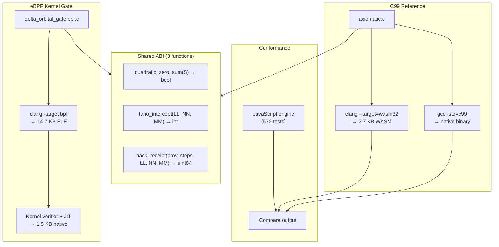

# The C99 Core: Minimal WASM Substrate

## Why C99

The quadratic and Delta Law gates must be run in environments where Node.js is unavailable: kernel BPF filters, embedded devices, WebAssembly sandboxes, and cleanroom assembly implementations. C99 is the lowest common denominator — compiles everywhere, including to WASM.

## The Conformance Gate

Section 12 of the formal ABI defines a conformance fixture that any implementation must pass. The C99 reference implementation compiles to a **2.7 KB standalone WASM module** while maintaining byte-level equivalence with the JavaScript engine across hundreds of random inputs.

## The 2.7 KB WASM Module

```
compile: clang -O2 --target=wasm32 -nostdlib
size:    2,768 bytes
tests:   572 passing (identical output to JS)
```

This proves the state space is flawlessly bounded. No floating point, no allocation, no system calls — just integer arithmetic on 16-bit registers.

## CBOS/BOM Chiral Framing

In the browser runtime, the Wasm core treats the omicron anchor as a Chiral Binary Object Stream byte-order mark:

| Anchor | Interpretation | Cross-term |
|--------|----------------|------------|
| `0x03BF` | `omi-`, forward CBOS/BOM | `+16xy` |
| `0x039F` | `-imo`, inverted CBOS/BOM | `-16xy` |

The core reads a 128-byte slot from the shared bus, extracts `y` from the low word, the combinator byte from the `16xy` cell, and `x` from the high pointer slice. It writes derived values, including Delta output, active orbit weight, and sexagesimal tick, back into terminal atomic registers.

The Wasm API mirrors the DevTools transaction surface:

```text
process_slot_atomic(ptr, slot, stream_position)
join_slots(ptr, slot_a, slot_b, target_slot)
emit_execution_envelope(ptr, slot, rule_slot)
```

Geometry-specific operations such as snub transforms are materializer rules. The core may emit the accepted rule address and receipt envelope, but it does not interpret that address as geometry before receipt.

## The eBPF Variant

The eBPF variant (`delta_orbital_gate.bpf.c`) compiles to a 14.7 KB ELF object that passes the kernel verifier:

```
clang -O2 -target bpf -g src/omi/ebpf/delta_orbital_gate.bpf.c
    → dist/delta_orbital_gate.o
    → bpftool prog load → JIT → live on NIC
```

## Shared ABI Surface

Both the C99 and eBPF implementations implement the same three functions:



1. `quadratic_zero_sum(uint16_t S[8]) → bool` — Gate 1
2. `fano_intercept(uint8_t LL, uint16_t NN, uint16_t MM) → int` — Gate 2
3. `pack_receipt(uint16_t provenance, uint8_t steps, uint8_t LL, uint16_t NN, uint16_t MM) → uint64_t` — Ring storage
