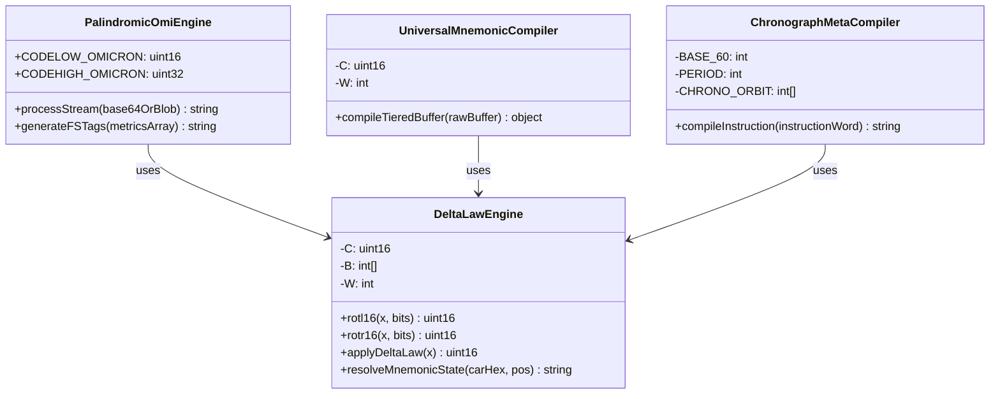
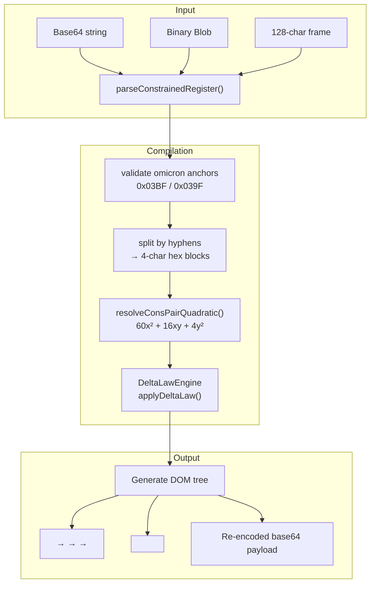

# The Node.js Compiler: PalindromicOmiEngine

## Universal Palindromic Mnemonic Activation Engine

The reference implementation is the `PalindromicOmiEngine` class — a Node.js runtime that translates base64 or blob payloads into OMI DOM structure.



```javascript
class PalindromicOmiEngine {
    constructor() {
        this.CODELOW_OMICRON = 0x03BF;   // Greek Small Letter Omicron
        this.CODEHIGH_OMICRON = 0x1D6B6;  // Mathematical Bold Capital Omicron
    }

    processStream(base64OrBlobPayload) {
        // Parses payload → 16-bit reads → <omi/> + <imo/> pairs
    }

    generateFSTags(metricsArray) {
        // Compiles <omi-fs> definitions and <imo-fs> wrappers
    }
}
```

## The Constrained Register Parser

For the fixed 128-character frame format:

```javascript
function parseConstrainedRegister(streamString) {
    // Validates 0x03BF / 0x039F anchors (forward or inverted)
    // Strips anchors → splits by hyphen → 4-char hex blocks
    // Extracts 2^1 flags and 2^5 addresses
    // Generates <omi-fs> → <imo-gs> → <imo-rs> → <imo-us> tree
}
```

## The Cons-Pair Quadratic Resolver

For LISP-like car/cdr memory pointer pairs:

```javascript
function resolveConsPairQuadratic(carHex, cdrHex) {
    const x = parseInt(carHex, 16);   // car pointer (current block)
    const y = parseInt(cdrHex, 16);   // cdr pointer (next block)
    const quadraticResult = (60 * (x ** 2)) + (16 * x * y) + (4 * (y ** 2));
    // Maps result to <OMI-FS> → <IMO-GS> → <IMO-RS> → <IMO-US> hierarchy
}
```

## The Delta Law Engine

The period-8 transformation core:

```javascript
class DeltaLawEngine {
    constructor(constantC = 0xACAB) { ... }
    
    applyDeltaLaw(x) {
        const r1 = rotl16(x, 1);
        const r3 = rotl16(x, 3);
        const rr2 = rotr16(x, 2);
        return (r1 ^ r3 ^ rr2 ^ this.C) & 0xFFFF;
    }
}
```

## The Universal Mnemonic Compiler

The top-level compiler that orchestrates the full pipeline:

```javascript
class UniversalMnemonicCompiler {
    compileTieredBuffer(raw1024BitBuffer) {
        // Enforce 128-byte frame
        // Extract low-plane (y) and high-plane (x) data
        // Solve quadratic equation
        // Generate full DOM tree with CSSOM/JSDOM binding
    }
}
```

## Compiler Pipeline Flow



## The Chronograph Meta-Compiler

The meta-circular layer that treats instructions as both code and data:

```javascript
class ChronographMetaCompiler {
    compileInstruction(instructionWord1024) {
        // Verify omicron encapsulation
        // Decode sexagesimal grid scalars
        // Compute spatial checksum + chronograph tick
        // Assemble meta-memory output tree with wormhole portals
    }
}
```

## Reverse Parser and Shared Bus

The compiler is complete only when it can round-trip:

```text
128-byte frame -> DOM/SpectrumDOM -> 128-byte frame
```

The reverse parser reads a canonical selector such as `omi-CANONICAL_MAPPING_OF_0x4A5B_TO_0xAA55`, extracts the `y` half-precision word, reads `x` from the projected coordinate/pointer field, recovers the chronograph tick from CSS rotation, and repacks the values into a 128-byte frame bounded by `0x03BF` and `0x039F`.

The shared-memory runtime uses:

```javascript
const sab = new SharedArrayBuffer(1024 * 16); // 16 KB
const atomicView = new Int32Array(sab);       // 128 slots, 32 i32 words per slot
```

Workers or Wasm write `deltaState`, `sexagesimalTick`, and provenance RGB fields into terminal slot words. DevTools can then inspect the memory bus and force `join`, `compose`, `parse`, and `replay` transactions without leaving the browser.

## SpectrumDOM and Snub-Roll Output

SpectrumDOM maps register state to color:

```text
G(AA) = (V:RR, E:GG, I:BB, A:AA)
```

| Channel | Source |
|---------|--------|
| `RR` | `4y^2` atomic features and Delta output |
| `GG` | `16xy` ASCII/Unicode combinator |
| `BB` | `60x^2` high synset/pointer field |
| `AA` | `unicode-bidi` reader-lens alpha |

The snub-roll transformation truncates low data at `0x7C00` and flattens `RRGGBBAA` into `RGB`. In forward `ltr` mode alpha acts as visual opacity; in inverted `rtl` mode alpha becomes a recovery multiplier for provenance tracing. This is projection behavior only; `unicode-bidi` does not authorize lower frame validity.
