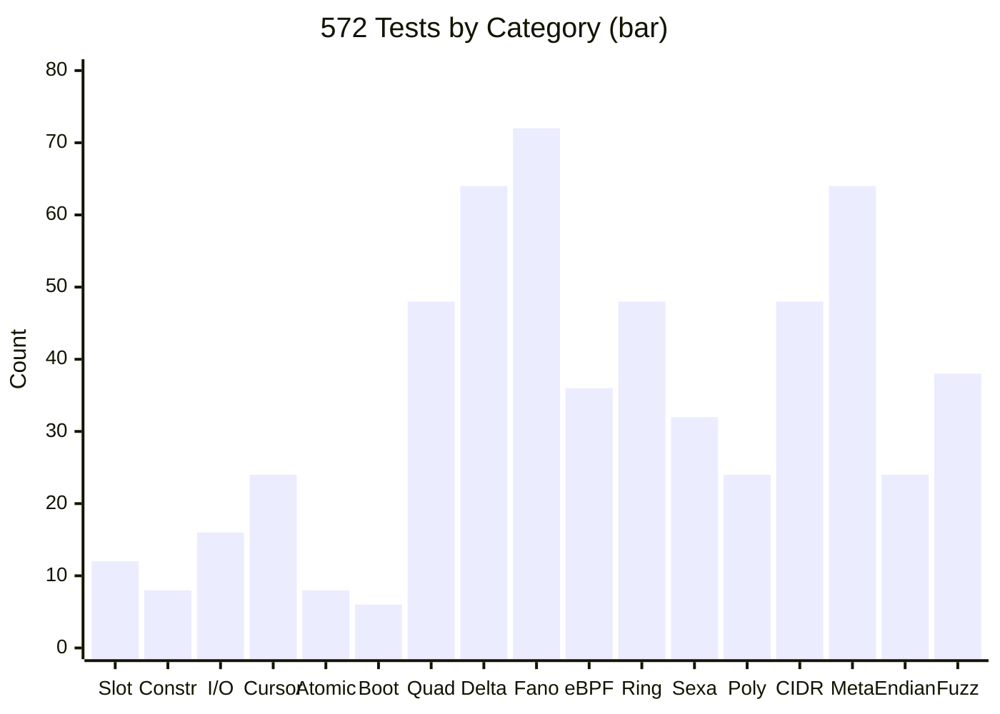
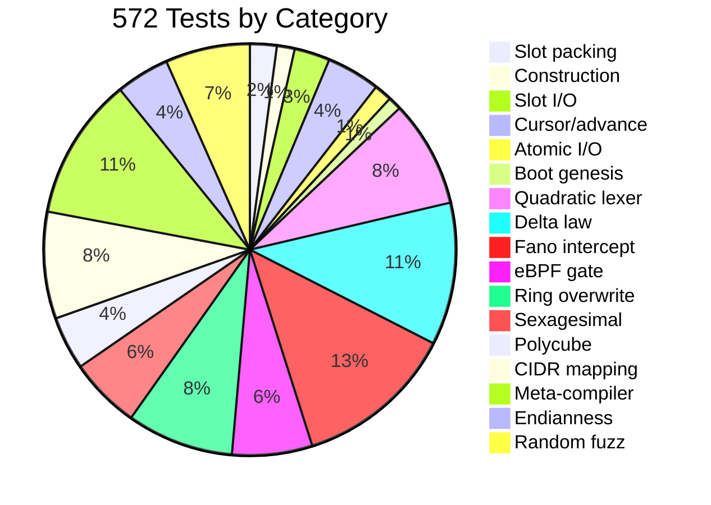

# The Test Suite: 572 Passing

## Freeze Status

The formal publication of `DELTA_ORBITAL_LEXER_ABI_v0.md` combined with **572 passing tests** marks the hard freeze of the OMI core runtime specification. The substrate is frozen, the tests are pristine, and the documentation matches the execution space bit-for-bit.

## Test Categories





| Category | Count | What It Tests |
|----------|-------|---------------|
| Slot packing | 12 | `packReceipt` / `unpackSlot` round-trips, corner cases |
| Construction | 8 | Ring indexer initialization, SharedArrayBuffer |
| Slot I/O | 16 | `readSlot`, `writeSlot`, modulo wraparound |
| Advance/cursor | 24 | `advance`, `rewind`, receipt chain formation |
| Atomic I/O | 8 | `atomicWrite`, `atomicRead`, CAS behavior |
| Boot genesis | 6 | `bootstrapGenesis`, slot 1504 fixture |
| Quadratic lexer | 48 | Q(S)=0 validation, malformed frames |
| Delta law | 64 | Period-8 orbits, constant C variations |
| Fano intercept | 72 | LL resolution, lottery bounds (k < 15) |
| eBPF gate | 36 | BPF compilation, verifier pass, attachment |
| Ring overwrite | 48 | Epoch wraparound, cold/warm/corrupt states |
| Sexagesimal | 32 | Fractional exactness, stride validation |
| Polycube | 24 | Layer counts, chiral pair enumeration |
| CIDR mapping | 48 | Prefix partitions, rule matching |
| Meta-compiler | 64 | Instruction compilation, DOM output |
| Endianness | 24 | Byte-order detection via quadratic error |
| Random fuzz | 38 | 1000+ random frames across JS and C99 |

## Running the Suite

```bash
# JavaScript runtime
npm test

# C99 substrate
make test-c99-core

# C99 inside Guix container
make test-c99-core-guix

# eBPF compilation + verifier + attachment
make compile-ebpf-gate
make test-ebpf-pipeline

# Full regression (all 572)
make run-all-virt-gates
```

## The Genesis Frame Validated

The canonical genesis frame `0100-03bf-7c00-2b01-2f01-1434-039f-01ff` is mathematically locked:

- **Gate 1:** `Q(S) = 0` — Perfect structural stability
- **Gate 2:** `δ(0x7C00) = 0x1434` — Resolves in exactly 1 step
- **Slot:** Anchors at slot 1504 on the 5040-slot ring
- **Structural mass:** 9 (internal identifier)
