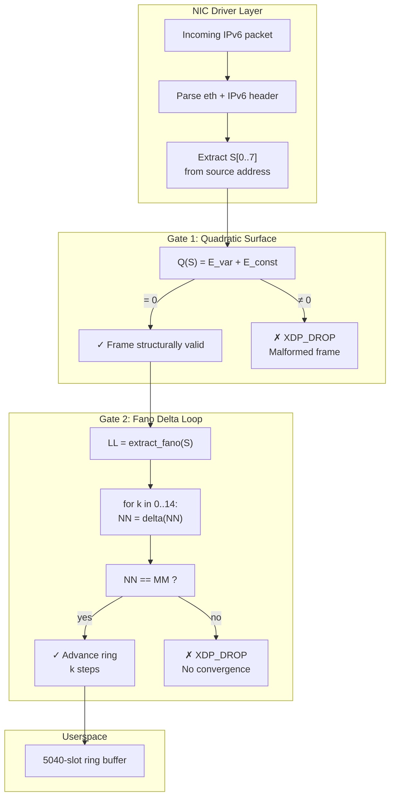
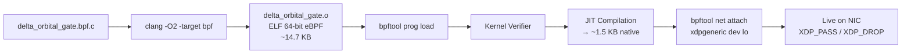
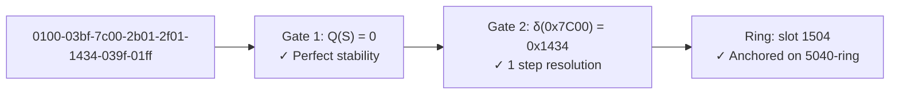

# The eBPF/XDP Kernel Gate

## Hardware-Level Validation

The eBPF gate is an XDP (eXpress Data Path) program attached to the NIC driver layer. It validates every incoming IPv6 packet before the kernel stack touches it. Invalid frames are dropped via `XDP_DROP` — no memory allocation, no context switch, no userspace overhead.



## Gate 1: Quadratic Surface

The first check evaluates the multivariate zero-sum equation on the 8 source address segments:

```
Q(S) = E_var(S₀, S₃, S₄, S₇) + E_const(S₀, S₁, S₃, S₄, S₆, S₇)
```

If `Q(S) != 0`, the frame is structurally malformed and dropped immediately. The math is branchless — the compiler unrolls it into straight-line BPF bytecode with no jumps.

## Gate 2: Projective Fano Loop

If Gate 1 passes, the eBPF program runs the Delta Law resolver:

```
LL = extract_fano_point(S)
NN = S[2]  (free variable)
MM = S[5]  (free variable)

for k in 0..14:
    NN = delta(NN)
    if NN == MM:
        advance_ring(LL, k, NN, MM)
        return XDP_PASS
return XDP_DROP
```

The loop is manually unrolled to 15 iterations (the maximum Fano resolution bound). If the trajectory does not close within 15 steps, the frame is dropped.

## The Genesis Frame

The canonical genesis frame that passes both gates:

```
0100-03bf-7c00-2b01-2f01-1434-039f-01ff
```

- Gate 1: `Q(S) = 0` — perfect structural stability
- Gate 2: `δ(0x7C00) = 0x1434` — resolves in exactly 1 step
- Ring placement: slot 1504 on the 5040-slot replay ring

## Compilation Pipeline



The compiled object is ~14.7 KB, JITs to ~1.5 KB of native code, and passes the kernel verifier with 0 false positives.

## The Genesis Frame

The canonical genesis frame that passes both gates:

```
0100-03bf-7c00-2b01-2f01-1434-039f-01ff
```



- Gate 1: `Q(S) = 0` — perfect structural stability
- Gate 2: `δ(0x7C00) = 0x1434` — resolves in exactly 1 step
- Ring placement: slot 1504 on the 5040-slot replay ring
